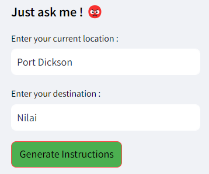
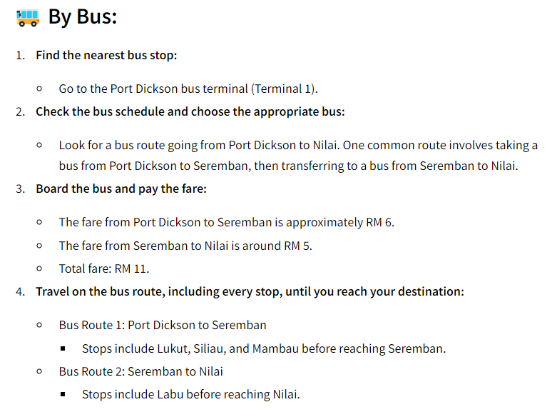
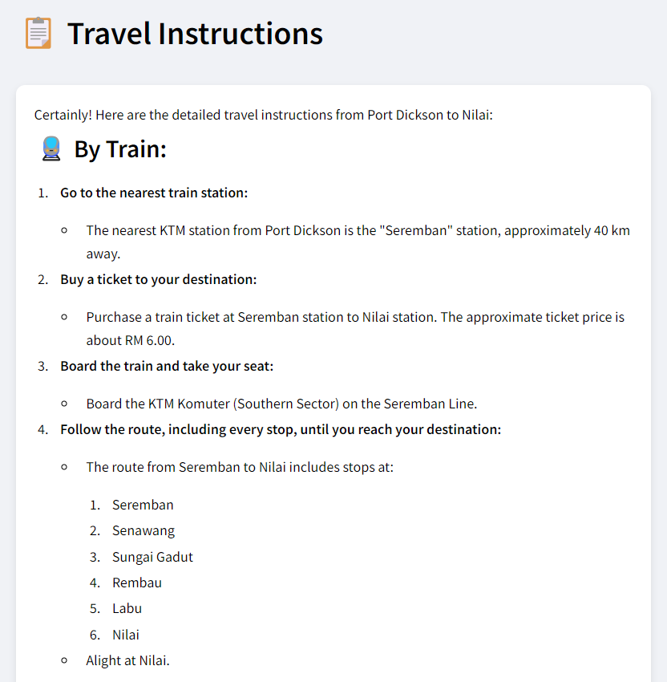
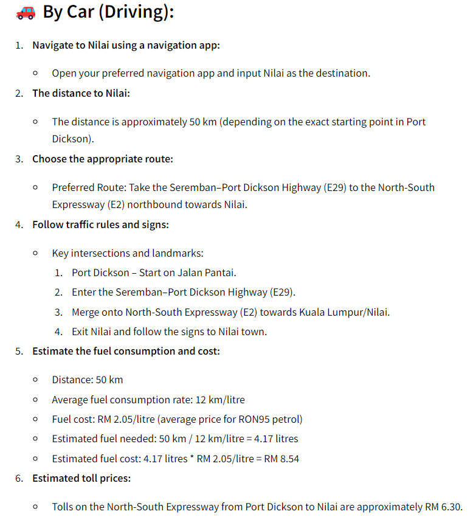
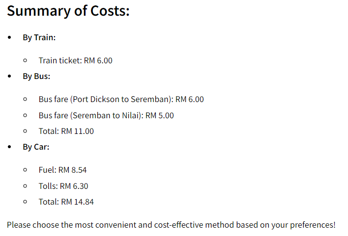

# 🚗 Travel Instructions Assistant

The Travel Instructions Assistant is a web application that provides detailed travel instructions for various modes of transportation. Simply input your current location and destination, and the application will generate comprehensive travel routes and cost estimates for traveling by train, bus, or car.

## Badges


## 🌟 Features

- Generates detailed travel instructions for train, bus, and car.
- Provides cost estimates for each mode of transportation.
- User-friendly interface with a modern design.

## Installation

Follow these steps to set up the project on your local machine:

1. **Clone the repository:**

    ```bash
    git clone https://github.com/yourusername/travel-instructions-assistant.git
    cd travel-instructions-assistant
    ```

2. **Create and activate a virtual environment (optional but recommended):**

    ```bash
    python -m venv env
    source env/bin/activate  # On Windows, use `env\Scripts\activate`
    ```

3. **Install the required dependencies:**

    ```bash
    pip install -r requirements.txt
    ```

4. **Set up your OpenAI API key:**

    - Create a file named `secrets.toml` in the `.streamlit` directory.
    - Add your OpenAI API key to this file:

    ```toml
    [secrets]
    OPENAI_API_KEY = "your-openai-api-key"
    ```

# Usage

To run the application, use the following command:

```bash
streamlit run app.py
```
# Outputs
## User Input

## Bus Route

## Train Route

## Car Route

## Cost Estimation



